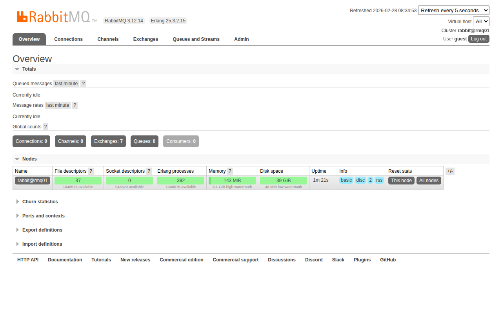
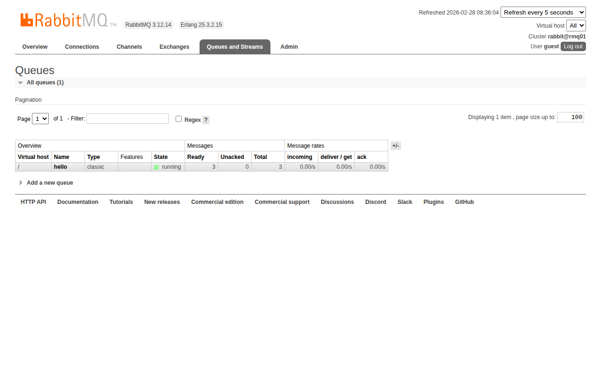
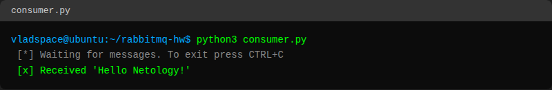
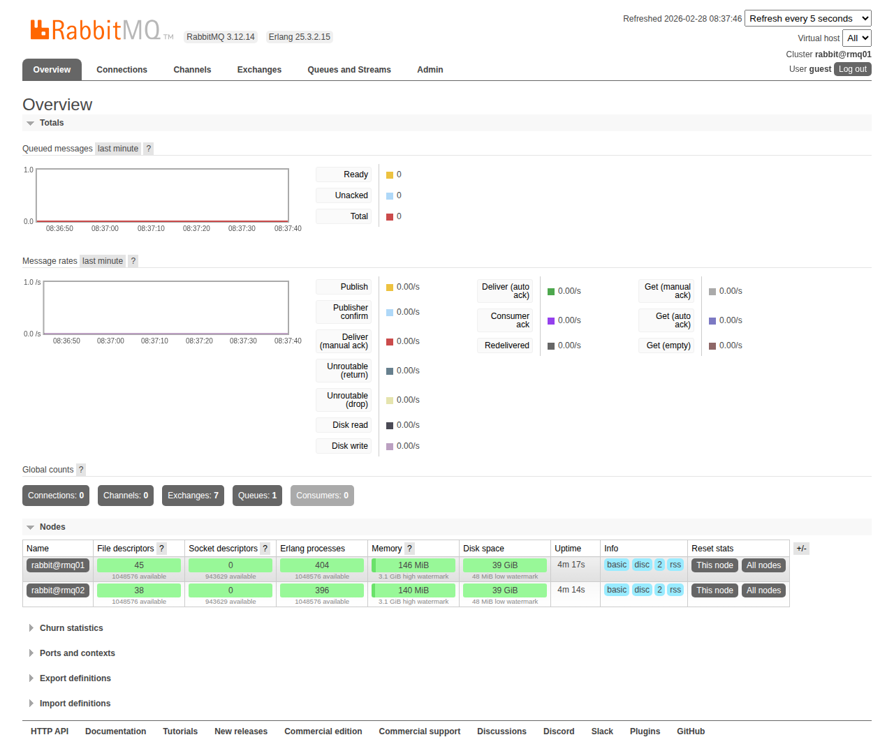
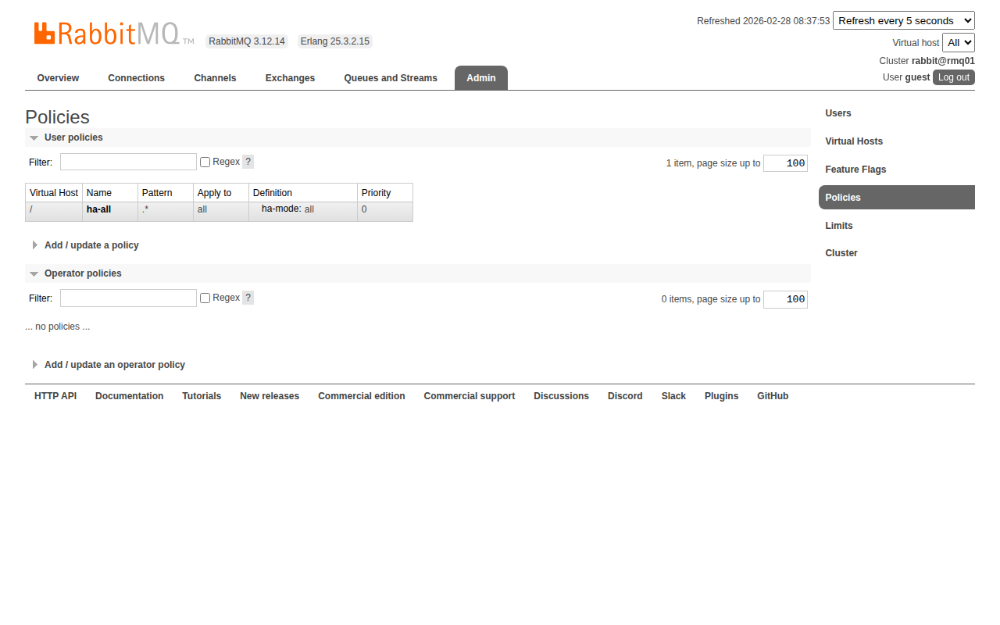
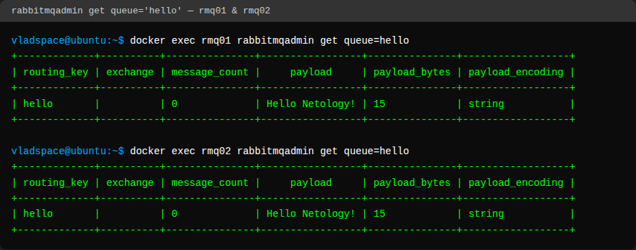
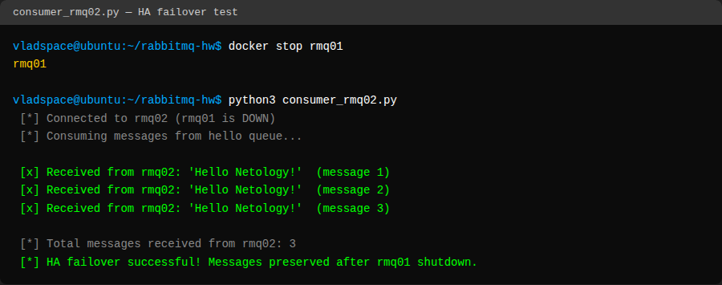

# Домашнее задание к занятию «Очереди RabbitMQ» — Пак Владислав

---

## Задание 1. Установка RabbitMQ

RabbitMQ 3.12.14 установлен через Docker с management plugin.

**Docker Compose** запускает контейнер с образом `rabbitmq:3.12-management`, который уже включает management plugin.

```bash
docker compose up -d
```

Management UI доступен на порту 15672 (http://localhost:15672).

**Скриншот веб-интерфейса RabbitMQ:**



---

## Задание 2. Отправка и получение сообщений

### Отправка сообщений (producer.py)

```bash
python3 producer.py
```


### Очередь hello в веб-интерфейсе (3 сообщения Ready)



### Получение сообщений (consumer.py)

```bash
python3 consumer.py
```



---

## Задание 3. Подготовка HA кластера

### Настройка кластера

Две ноды RabbitMQ запущены через Docker Compose (`rmq01` и `rmq02`) в одной Docker-сети.

Объединение в кластер:

```bash
docker exec rmq02 rabbitmqctl stop_app
docker exec rmq02 rabbitmqctl reset
docker exec rmq02 rabbitmqctl join_cluster rabbit@rmq01
docker exec rmq02 rabbitmqctl start_app
```

Создание политики ha-all:

```bash
docker exec rmq01 rabbitmqctl set_policy ha-all ".*" '{"ha-mode":"all"}'
```

### Скриншот: доступные ноды в кластере



### Скриншот: политика ha-all



### Вывод `rabbitmqctl cluster_status`

**Нода rmq01:**

```
Cluster status of node rabbit@rmq01 ...
Basics

Cluster name: rabbit@rmq01

Disk Nodes

rabbit@rmq01
rabbit@rmq02

Running Nodes

rabbit@rmq01
rabbit@rmq02

Versions

rabbit@rmq01: RabbitMQ 3.12.14 on Erlang 25.3.2.15
rabbit@rmq02: RabbitMQ 3.12.14 on Erlang 25.3.2.15
```

**Нода rmq02:**

```
Cluster status of node rabbit@rmq02 ...
Basics

Cluster name: rabbit@rmq02

Disk Nodes

rabbit@rmq01
rabbit@rmq02

Running Nodes

rabbit@rmq01
rabbit@rmq02

Versions

rabbit@rmq01: RabbitMQ 3.12.14 on Erlang 25.3.2.15
rabbit@rmq02: RabbitMQ 3.12.14 on Erlang 25.3.2.15
```

### Скриншот: `rabbitmqadmin get queue='hello'` на обеих нодах



### Тест HA failover

Остановлена нода rmq01 (к которой подключался producer), запущен consumer_rmq02.py на второй ноде:

```bash
docker stop rmq01
python3 consumer_rmq02.py
```

**Скриншот: consumer получает сообщения с rmq02 после отключения rmq01:**



Все сообщения успешно получены через вторую ноду — HA кластер работает корректно.

---

## Задание 4*. Ansible playbook для автоматического объединения нод в кластер

### Описание

Ansible playbook для автоматической установки RabbitMQ на любое количество нод и объединения их в HA кластер с политикой `ha-all`.

### Структура

```
ansible/
├── inventory/
│   └── hosts.yml              # Inventory: rmq_master (1 нода) + rmq_slaves (N нод)
├── group_vars/
│   └── rabbitmq.yml           # Переменные: erlang cookie, пользователь, политика
├── roles/
│   └── rabbitmq/
│       ├── tasks/main.yml     # Install → Cookie → Plugin → Cluster → HA Policy
│       ├── handlers/main.yml  # Restart handler
│       └── templates/
│           └── rabbitmq.conf.j2
├── playbook.yml               # Главный playbook
└── README.md
```

### Что делает playbook

1. Устанавливает Erlang и RabbitMQ из официальных репозиториев
2. Настраивает единый Erlang cookie на всех нодах
3. Деплоит конфигурацию `rabbitmq.conf`
4. Включает management plugin
5. Объединяет slave ноды в кластер с master нодой (idempotent — не повторяет если уже в кластере)
6. Устанавливает HA политику `ha-all` для зеркалирования всех очередей
7. Создает admin пользователя

### Запуск

```bash
# 1. Отредактировать inventory с реальными IP адресами нод
vim ansible/inventory/hosts.yml

# 2. Изменить переменные (пароль, cookie) в group_vars
vim ansible/group_vars/rabbitmq.yml

# 3. Запустить playbook
cd ansible
ansible-playbook -i inventory/hosts.yml playbook.yml
```

### Масштабирование

Для добавления новых нод — достаточно добавить их в секцию `rmq_slaves` в `inventory/hosts.yml` и перезапустить playbook:

```yaml
rmq_slaves:
  hosts:
    rmq02:
      ansible_host: 192.168.1.12
    rmq03:
      ansible_host: 192.168.1.13
    rmq04:
      ansible_host: 192.168.1.14
```

---

## Файлы проекта

| Файл | Описание |
|------|----------|
| `docker-compose.yml` | Docker Compose для 2 нод RabbitMQ с management |
| `producer.py` | Скрипт отправки сообщений в очередь hello |
| `consumer.py` | Скрипт получения сообщений (rmq01, порт 5672) |
| `consumer_rmq02.py` | Скрипт получения сообщений (rmq02, порт 5673) |
| `ansible/` | Ansible playbook для автоматического развертывания HA кластера |
